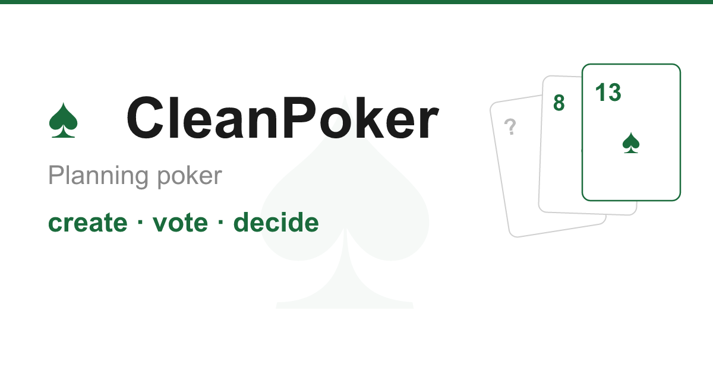

<div align="center">



# CleanPoker ♠️

**Free planning poker for agile teams. No account, no tracking, no bullshit.**

**[→ Try it at cleanpoker.dev](https://cleanpoker.dev)**

[](https://github.com/florianmousseau/cleanpoker/actions/workflows/deploy.yml)
[](https://github.com/florianmousseau/cleanpoker/actions/workflows/codeql.yml)
[](https://sonarcloud.io/project/overview?id=florianmousseau_cleanpoker)
[](https://sonarcloud.io/project/overview?id=florianmousseau_cleanpoker)
[](https://sonarcloud.io/project/overview?id=florianmousseau_cleanpoker)
[](LICENSE)

[](https://cleanpoker.dev)
[](https://cleanpoker.dev/accessibilite)
[](https://cleanpoker.dev)
[](https://www.thegreenwebfoundation.org/)
[](https://cleanpoker.dev)

</div>

---

## Why CleanPoker?

Most planning poker tools show ads, track users, and weigh megabytes. CleanPoker does the opposite.

| What others do | CleanPoker |
|---|---|
| Ads / freemium upsells | Zero ads, zero monetization |
| Google Analytics, cookies | Zero trackers, zero cookies |
| Require account creation | No account, just a link |
| Heavy JS bundles | < 50 KB page weight |
| Accessibility as an afterthought | Lighthouse accessibility **100** |

## Features

- **Instant room**: create a session, share the URL, done
- **Custom card decks**: Fibonacci, T-shirt, 2n, or any values you want
- **Real-time votes**: WebSocket, no polling
- **Reveal & new round**: smooth flow for sprint planning
- **Observers**: product owners and stakeholders can watch without voting
- **Kick / role switch**: host controls for unruly participants
- **Full keyboard nav**: tab through everything
- **Screen reader support**: NVDA, VoiceOver, `aria-live` for real-time updates
- **5 languages**: FR, EN, ES, DE, PT with browser auto-detection
- **Persistent rooms**: survive backend restarts, auto-deleted after 24h inactivity
- **Auto-reconnect**: WebSocket reconnects automatically with exponential backoff

## Goals

| Metric | Target |
|---|---|
| CO₂ / visit | < 0.1g |
| Lighthouse Performance | 100 |
| Lighthouse Accessibility | 100 |
| Page weight | < 50 KB |
| Third-party cookies | 0 |
| Trackers | 0 |

## Stack

| Layer | Tech | Why |
|---|---|---|
| Backend | Go + `golang.org/x/net/websocket` | ~15 MB RAM, native binary, no runtime |
| Frontend | SvelteKit 5 (runes) | SSR, zero virtual DOM, minimal bundle |
| Frontend hosting | Cloudflare Pages | Global CDN, renewable energy |
| Backend hosting | Fly.io `cdg` Paris | Renewable energy, EU data residency |
| Database | SQLite (`modernc.org/sqlite`) | Rooms survive deploys, pure Go, no CGO |

## Quality & Security

Every push to `main` runs a full quality and security pipeline before deploying.

| Tool | What it checks | Dashboard |
|---|---|---|
| **golangci-lint** | Go static analysis (errcheck, staticcheck, govet…) | GitHub Actions |
| **ESLint** | TypeScript + Svelte code quality | GitHub Actions |
| **SonarCloud** | Bugs, code smells, security hotspots | [sonarcloud.io →](https://sonarcloud.io/project/overview?id=florianmousseau_cleanpoker) |
| **CodeQL** | SAST vulnerability scan (Go + TypeScript) | [Security tab →](https://github.com/florianmousseau/cleanpoker/security/code-scanning) |
| **Lighthouse CI** | Performance, accessibility, SEO, PWA after each deploy | GitHub Actions |
| **Dependabot** | Automated dependency updates (npm, Go, Actions) | [Pull requests →](https://github.com/florianmousseau/cleanpoker/pulls) |
| **Eco-CI** | CI pipeline energy consumption estimate | GitHub Actions summary |

## Green IT

- **Zero trackers**: no Google Analytics, no third-party scripts, no cookies
- **System fonts**: no Google Fonts download
- **Vanilla CSS**: no CSS framework (Tailwind, Bootstrap, etc.)
- **Zero virtual DOM**: SvelteKit compiles to vanilla JS
- **Minimal runtime**: Go binary ~15 MB RAM, Alpine Docker image
- **Green hosting**: Cloudflare Pages + Fly.io CDG both run on renewable energy
- **CI energy tracked**: each pipeline run is measured by Eco-CI

## Accessibility (WCAG 2.1 AA)

- Native HTML semantics (`<button>`, `<main>`, `<section>`, `<table>`)
- Skip link at the top of the page
- `aria-live="polite"` for real-time vote updates
- `aria-label` on all interactive elements
- Contrast ratio >= 4.5:1 throughout
- `prefers-reduced-motion` respected
- `rem` units (browser zoom works correctly)
- No `user-scalable=no`

## Run locally

```bash
# Backend
cd backend
go mod tidy
go run ./cmd/server

# Frontend (separate terminal)
cd frontend
npm install
cp .env.example .env
npm run dev
```

Open `http://localhost:5173`.

## Deploy

CI/CD via GitHub Actions — auto-deploys on push to `main`, quality gate must pass first.

```
quality (lint + SAST + SonarCloud) → deploy-frontend + deploy-backend → lighthouse audit
```

Required GitHub secrets:

| Secret | Used for |
|---|---|
| `CLOUDFLARE_API_TOKEN` | Cloudflare Pages deploy |
| `CLOUDFLARE_ACCOUNT_ID` | Cloudflare Pages deploy |
| `FLY_API_TOKEN` | Fly.io backend deploy |
| `SONAR_TOKEN` | SonarCloud analysis |

## License

MIT, see [LICENSE](LICENSE).

---

<div align="center">

Made by [Florian Mousseau](https://github.com/florianmousseau) · [cleanpoker.dev](https://cleanpoker.dev)

</div>
