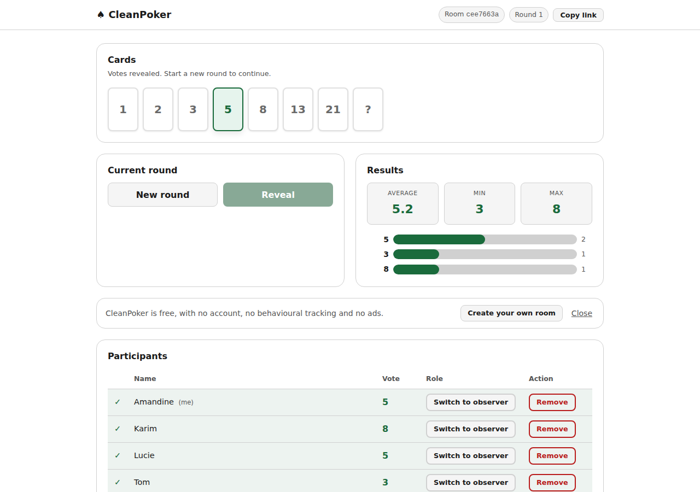

# CleanPoker

Planning poker for agile teams, in the browser. Create a room, share its link, vote, reveal. No account, no install.

Live at **[cleanpoker.dev](https://cleanpoker.dev)**, in English, French, Spanish, German and Portuguese.

[](https://github.com/florianmousseau/cleanpoker/actions/workflows/deploy.yml)
[](https://github.com/florianmousseau/cleanpoker/actions/workflows/codeql.yml)
[](https://sonarcloud.io/project/overview?id=florianmousseau_cleanpoker)
[](LICENSE)
[](https://cleanpoker.dev/green)



## What it does

- **Rooms by link**: the home page creates a room, and anyone with the URL can join by typing a name.
- **Card decks**: Fibonacci, T-shirt and powers of two presets, or any comma-separated list.
- **Real-time votes** over a WebSocket. Votes stay hidden until someone reveals them. The results then show the average, min, max and distribution.
- **Observers** can follow a room without voting. Anyone in the room can switch a participant to observer or remove them. Removing someone asks for confirmation first.
- **Reconnection**: a dropped connection retries with exponential backoff. A reload within 30 seconds takes the same seat back, vote included.
- **Ephemeral**: rooms live in the server's memory and are deleted after 24 hours without activity. There is no database.
- **Accessibility**: semantic HTML, full keyboard use, and live regions that announce votes and results. The site respects `prefers-reduced-motion`. It targets WCAG 2.1 AA; the [accessibility statement](https://cleanpoker.dev/accessibilite) currently reads "partially conformant".

## Privacy

No analytics script, no advertising cookie, no visitor identifier, nothing loaded from a third party. Like any website, the host that serves the pages counts the requests it answers. The site also counts its own readers, server-side: a daily fingerprint derived from the IP address, which is never kept. Both counts are server-side and never touch the reader's device. `npm run mesure` checks that the pages keep saying both halves of this.

## Run it locally

Requires Go (the version in [`backend/go.mod`](backend/go.mod)) and Node 22.

```bash
./dev.sh
```

Then open http://localhost:5173. The script creates `frontend/.env` from `.env.example` and installs the frontend dependencies on the first run. It then starts the backend on `:8080` and the Vite dev server on `:5173`. Ctrl+C stops both.

On Windows without a POSIX shell, run the two halves in separate terminals:

```bash
cd backend && go run ./cmd/server
cd frontend && npm ci && cp .env.example .env && npm run dev
```

## Architecture

| Part | Runs on | Talks to the browser over |
|---|---|---|
| SvelteKit 5 frontend: pages, SSR, security headers | Cloudflare Pages | HTTP |
| Go backend: rooms in memory, one goroutine per room | Fly.io, Paris region | WebSocket, plus `POST /rooms` |

- **`backend/`** is Go with the standard library HTTP server and `golang.org/x/net/websocket`. `internal/store` holds the rooms in a map. `internal/room` owns each room's state behind one event loop, which broadcasts a snapshot on every change and masks the votes until they are revealed. `internal/handler` exposes `POST /rooms`, `GET /rooms/{id}/ws`, `/health` and `/stats`.
- **`frontend/`** is SvelteKit 5 with runes, TypeScript and plain CSS, deployed with `adapter-cloudflare`. `src/lib/useRoom.svelte.ts` holds the WebSocket client and `src/routes/[id]` the room page. The translations for the five languages live in `src/lib/i18n.ts`.
- Security headers are set in two places that must stay in sync. `frontend/src/hooks.server.ts` covers pages rendered by the worker and `frontend/_headers` covers static files.

## Checks

Every pull request runs the same steps as the `Code Quality` and `Bundle Size` jobs of [`deploy.yml`](.github/workflows/deploy.yml):

| Command | What it checks |
|---|---|
| `golangci-lint run` (in `backend/`) | errcheck, govet, staticcheck, ineffassign, unused, bodyclose |
| `go test ./...` | backend unit and WebSocket tests |
| `npm run lint` | ESLint on TypeScript and Svelte |
| `npm run check` | svelte-check types |
| `npm test` | Vitest, including French typography rules |
| `npm run check:seo` | titles, descriptions and alternates of every page |
| `npm run check:reflow` | CSS that could push a page past a 320 px screen |
| `npm run mesure` | no measurement script, and the privacy wording above in five languages |
| `npm run build && npm run size` | shared JS stays under 50 kB brotli |

CodeQL scans Go and TypeScript, and SonarCloud analyses the code on each run. After each production deploy, Lighthouse CI audits the live site.

## Contributing

See [CONTRIBUTING.md](CONTRIBUTING.md).

## License

[MIT](LICENSE)
